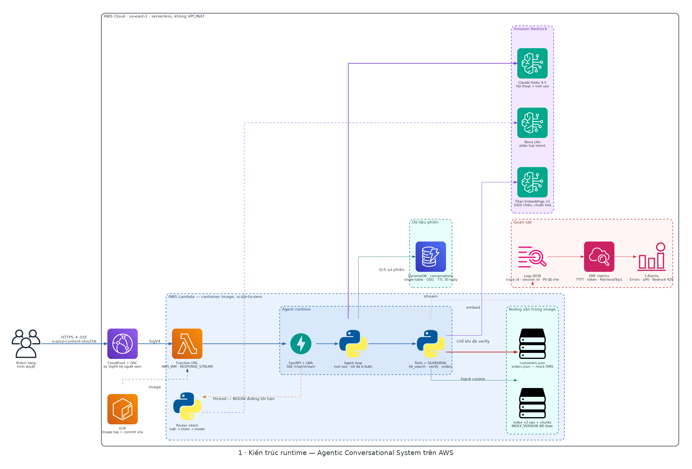
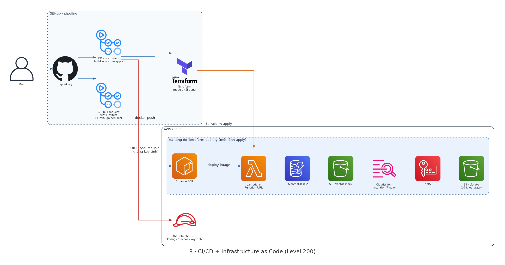
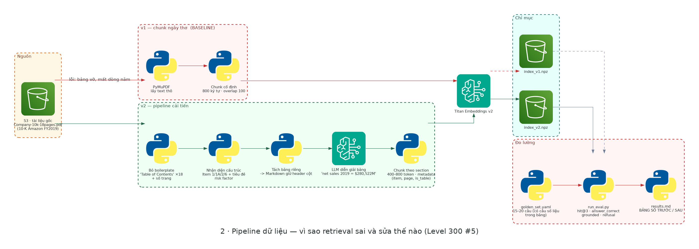

# Agentic Conversational System — Solution Document

**Solution Engineer Intern assignment · Cloud Kinetics VN**

Live: **https://d2ndqmawls4x5x.cloudfront.net/** · Repo: `tqtcse/ck-solution-engineer-assignment`

---

## 0. What was built, in one paragraph

A customer-support agent for a US e-commerce company, running on AWS. It answers questions
from a 10-K filing with page citations, and it checks order shipment status — but only after
verifying the customer's identity. Everything is serverless and scales to zero. Every push to
`main` builds a container image, applies Terraform, and smoke-tests the result. The whole
system cost **$0.15** to build and run over twelve days.

One idea runs through the whole design:

> **Every security decision is deterministic code. The model only phrases things.**

The rule *"disclose no order data before verification"* lives in the tool layer, not in the
system prompt. A prompt is text, and text is something the user can influence. A `if not
state.verified: return {"error": "NOT_VERIFIED"}` is not.

Section 7 shows that this claim is tested, not just asserted.

---

## 1. Architecture



*Full resolution: [SVG](img/1-kien-truc-runtime.svg). Source and regeneration instructions: [`docs/img/`](img/README.md).*

```
Browser ──HTTPS + SSE──► CloudFront + OAC ──SigV4──► Lambda Function URL
                                                      (AWS_IAM, RESPONSE_STREAM)
                                                          │
                                    ┌─────────────────────┴──────────────────────┐
                                    │  FastAPI + Lambda Web Adapter              │
                                    │    agent loop  ──►  tools (GUARDRAIL)      │
                                    │    router (separate thread)                │
                                    └─────────────────────┬──────────────────────┘
                                                          │
        Bedrock: Haiku 4.5 (chat) · Nova Lite (router) · Titan v2 (embeddings)
        In image: index_v2.npz + chunks · customers.json · orders.json
        DynamoDB: conversations (single table, GSI1, TTL)
        CloudWatch: JSON logs · EMF metrics · 3 alarms
```

### Why these choices

| Decision | Reason |
|---|---|
| **Lambda container image**, not zip | The numpy + index payload exceeds the 250 MB unzipped zip limit comfortably; an image also makes the runtime reproducible and lets the image tag equal the commit sha. |
| **Lambda Web Adapter** | Lets one FastAPI app run unchanged locally (`uvicorn`) and in Lambda. No handler shim, no second code path to test. |
| **Function URL, not API Gateway** | API Gateway cannot stream a response. Streaming is the whole point of the UX, so the gateway was the wrong tool. |
| **CloudFront in front** | Not decoration — see §4.2. This account blocks `authorization_type = "NONE"` on Function URLs, so the only way to expose the app publicly was an authenticated origin with a signer in front. |
| **Vector index baked into the image** | 128 chunks, 488 KB. A vector database for this would be architecture theatre. `INDEX_VERSION` makes it a runtime switch anyway (§6.4). |
| **DynamoDB for conversations only** | Append-only writes, always keyed by a known `session_id`, unbounded growth, single-digit-ms reads, pay-per-request. No join on the hot path. |
| **`customers.json` / `orders.json` in the image** | The assignment says a mock API or local tool result is acceptable. Spending the time budget on a real OMS would have bought nothing the grader can see. |

---

## 2. Level 100 — Core conversational agent

### 2.1 Knowledge-based QA (retrieval as a tool)

Retrieval is exposed to the model as a tool (`search_knowledge_base`), not stuffed into the
prompt. The model decides when it needs the document, which means an order-status turn costs
no embedding call at all.

```
question ──► Titan Embeddings v2 (1024-dim, normalized)
         ──► cosine against 128 chunk vectors  (normalized ⇒ cosine = dot product)
         ──► top-3 chunks with page numbers
         ──► model answers, citing "(page N)"
```

**Grounding is measured, not assumed.** Because the source document is Amazon's 10-K, a model
could answer correctly from pretraining and look like RAG. So every expected answer string was
checked for physical presence in the retrieved chunks:

| | v1 index | v2 index |
|---|---|---|
| Answer present in retrieved context | 8/10 | **10/10** |
| `correct = True` **with no evidence in context** | **0** | **0** |

The bottom row is the one that matters: **no answer was produced from the model's own memory.**

### 2.2 Verification and the order workflow

Three fields, each parsed by deterministic code in `app/verification.py`:

| Field | Rule | Behaviour |
|---|---|---|
| Email | Must match `@ck<integer>` | `bob@gmail.com` and `x@ckabc.com` are rejected |
| SSN | Last 4 digits, *"even if user input more"* | `123-45-6789` → `6789`; `my ssn is 123-45-6789` → `6789` |
| Date of birth | Any format, including natural language | `Jan 5 1990`, `I was born on January 5th, 1990`, `1990-01-05` all → `1990-01-05` |

**Ambiguous dates are asked about, not guessed.** `05/01/1990` is 5 January in most of the
world and 1 May in the US. The parser returns an `Ambiguous` object carrying both readings,
and the agent asks the customer which one is right. Guessing here is a verification failure
for a real customer.

**The fields accumulate server-side, one at a time.** The tool accepts any subset and replies
with `still_needed`. This matters for a reason that only shows up in practice: a model asked
to collect three things will otherwise try to remember them across turns and paraphrase them
back. The system prompt therefore forbids re-reading values from earlier messages — the server
is the only place they are kept.

After verification, `list_orders` returns the customer's three order IDs and the agent asks
which one. It never picks for them.

### 2.3 The guardrail layer

```python
def _list_orders(_args, state: SessionState):
    if not state.verified:
        return {"error": "NOT_VERIFIED", ...}

def _get_order_status(args, state: SessionState):
    if not state.verified:
        return {"error": "NOT_VERIFIED", ...}
    ...
    if o["customer_id"] != state.customer_id:
        return {"error": "NOT_YOUR_ORDER", ...}
```

Two details that are easy to miss and are both tested:

- **A refused lookup returns the same thing whether the order exists or not.** Otherwise an
  attacker enumerates valid order IDs without ever verifying.
- **A failed verification clears everything collected so far.** Otherwise an attacker keeps a
  correct email and DOB and brute-forces 10 000 SSN values one at a time.

### 2.4 Multi-turn conversation

History lives in DynamoDB, not in process memory (§5). Each turn loads the last 12 messages,
merges consecutive same-role messages (Bedrock rejects two user turns in a row), and drops any
leading assistant message (Bedrock requires the first message to be `user`).

---

## 3. Level 200 — Deployment and operations

### 3.1 Infrastructure as Code — two Terraform roots, on purpose

```
infra/bootstrap/   applied by hand with admin credentials
                   S3 state bucket · GitHub OIDC provider · the CI role itself · Lambda role
infra/             applied by CI
                   ECR · Lambda · Function URL · CloudFront + OAC · DynamoDB · logs · alarms
```

The split is the point: **CI must not be able to widen its own permissions.** If the pipeline
could apply the policy that grants the pipeline its rights, the boundary means nothing. This
cost a round trip during the build — adding the alarms failed until the bootstrap role was
granted `cloudwatch:PutMetricAlarm` by hand — and that round trip is the design working.

State locking uses `use_lockfile = true` (S3 native locking, Terraform ≥ 1.10). No DynamoDB
lock table.

### 3.2 Streaming

`invoke_mode = "RESPONSE_STREAM"` on the Function URL, `AWS_LWA_INVOKE_MODE=response_stream`
on the adapter, SSE from FastAPI. Measured on the deployed Lambda:

```
TtftMs      avg  894 ms    max 1440 ms
LatencyMs   avg 1744 ms    max 2514 ms
```

TTFT is measured **at the moment the first token leaves the server**, not when the model
finishes. Streaming sells the experience on TTFT; total latency hides what the user feels.

### 3.3 CI/CD



```
push to main
  ├─ test       ruff + pytest -m "not aws"          (fails ⇒ nothing deploys)
  ├─ terraform  fmt -check · init -backend=false · validate
  ├─ build      docker buildx → ECR, image tag = commit sha
  ├─ apply      terraform apply -var image_tag=<sha>
  └─ smoke      POST through CloudFront, assert 200
```

Auth is **GitHub OIDC**, no static AWS keys anywhere. The trust policy pins the subject to
`repo:owner@<id>/repo@<id>:ref:refs/heads/main` — GitHub's immutable subject claims, which use
numeric IDs rather than names so that renaming the repo or the org cannot silently transfer
access.

**Image tag = commit sha** means "what is running in production" is a git question, not a
guess. Every deploy in this project was verified by comparing the Lambda's image tag against
`git rev-parse HEAD`.

---

## 4. Two production problems that shaped the design

### 4.1 Verification failed with the assignment's own sample data

The sample SSN in the assignment is `123-45-6789`, whose last four digits are `6789`. The
seeded customer record had `1234`. Every verification attempt using the assignment's own
example failed. Fixed in the data.

### 4.2 Function URLs are blocked account-wide — CloudFront is not optional here

`authorization_type = "NONE"` returned 403 for every caller. Rather than guess, this was
isolated by creating a throwaway Lambda with a fresh Function URL:

| Configuration | Result |
|---|---|
| `NONE` | 403 |
| `AWS_IAM` + SigV4 | 200 |

Service control policies were ruled out (management account, `list-roots` shows
`PolicyTypes: []`), as were the resource policy and function state. The block is account-wide
and outside this project's control.

So the Function URL stays on `AWS_IAM` and CloudFront + OAC signs on the viewer's behalf. Three
things had to be right, and each was wrong first:

1. **`Managed-AllViewerExceptHostHeader`.** Forwarding the viewer's `Host` header breaks SigV4,
   because the signature covers `Host` and the origin sees a different one.
2. **Two `aws_lambda_permission` resources**, not one — `lambda:InvokeFunctionUrl` *and*
   `lambda:InvokeFunction`.
3. **The client must send `x-amz-content-sha256`.** Lambda does not accept unsigned payloads,
   and CloudFront cannot compute the body hash for the viewer. The page does it in JS:

```javascript
const digest = await crypto.subtle.digest('SHA-256', new TextEncoder().encode(body));
```

A `POST` without that header returns 403 today — verified.

---

## 5. Level 300 §1–2 — Conversation data model

Single DynamoDB table, on-demand billing, TTL, encryption at rest with AWS-owned keys.

| Item | `pk` | `sk` | Key attributes |
|---|---|---|---|
| Session metadata | `SESS#<session_id>` | `META` | `created_at`, `last_activity_at`, `verified`, `customer_id`, `failed_attempts`, `expires_at` |
| Message | `SESS#<session_id>` | `MSG#<epoch_ms, 13 digits>#<6 hex>` | `role`, `content`, `model`, `tokens_in/out`, `latency_ms`, `expires_at` |

**GSI1** — `gsi1pk = CUST#<customer_id>`, `gsi1sk = TS#<created_at>` → "every past session of
this customer".

### Access patterns

| # | Need | Operation |
|---|---|---|
| 1 | Append a message | `PutItem` — O(1), **no read-modify-write** |
| 2 | Load the last N turns | `Query` on pk, `ScanIndexForward=False`, `Limit=N` |
| 3 | Read/write verification state | `GetItem` / `UpdateItem` on `META` |
| 4 | A customer's history | Query GSI1 |
| 5 | Offline analysis / eval | Export to S3 → Athena |

### Why it is shaped this way

- **Why the sort key is a timestamp, not a sequence number.** The first design used
  `MSG#<seq>`. That contradicts access pattern #1: producing a monotonic counter requires
  reading the current value before writing, which is read-modify-write and races when two
  turns land together. `epoch_ms` zero-padded to 13 digits sorts correctly as a string, and a
  6-hex suffix breaks ties inside the same millisecond. The write is a plain `PutItem`.
- **Why one item per message**, not one JSON blob per session: items cap at 400 KB, and
  rewriting the blob every turn is read-modify-write again.
- **Why partition by session:** one conversation per partition spreads load evenly; no hot
  partition.
- **Why history is stored as plain text**, not as Bedrock `toolUse`/`toolResult` blocks:
  Bedrock requires every `toolUse` to be followed by its `toolResult`, so an N-turn window
  that cuts between the pair raises `ValidationException` — and `toolResult` contains raw
  order data. Tool activity is logged separately, redacted.
- **TTL 30 days** on both item types. Hot data stays hot; older data can be streamed to S3
  Parquet for analysis without paying DynamoDB storage rates.
- **No raw PII is ever written.** See §6.3.

### Integration with the agent

`SessionState` is a thin dataclass loaded from `META` at the start of a turn and saved after
the tool loop. Nothing about a session lives in process memory, which means:

- A cold Lambda resumes an in-progress verification correctly.
- Concurrent requests for the same session all see the same state.

**Verified**, not assumed: six parallel requests to one verified session were served across
eleven distinct log streams, and all six returned order status.

---

## 6. Level 300 §3–5 — Observability, routing, preprocessing

### 6.1 Observability

Two primitives in `app/obs.py`, both writing to stdout:

```python
obs.log("retrieval", query=..., top1=..., pages=[...])   # structured JSON line
obs.metric("TtftMs", 894, "Milliseconds")                 # CloudWatch EMF
```

**EMF is the trick worth naming.** Print a correctly shaped JSON blob to stdout and CloudWatch
turns it into a metric by itself — no SDK, no `PutMetricData`, no added latency on the hot
path, no extra IAM permission. Six metrics appear automatically: `TtftMs`, `LatencyMs`,
`TokensIn`, `TokensOut`, `RetrievalTop1`, `BedrockThrottles`.

| Captured | Why |
|---|---|
| `trace_id` + `session_id` on every line | The unit of debugging is the **conversation**, not the request |
| Retrieval query, top-1 score, pages | The most common failure is a confident answer over retrieved garbage |
| Tool name, args (redacted), status, ms | Agents break at the tool layer more often than at the model layer |
| TTFT, total latency | What the user actually feels |
| Tokens in/out | The number the customer will ask about |
| Verification failures | A security signal: someone is probing |

**Three alarms**, all `treat_missing_data = "notBreaching"` so a quiet demo system sits at `OK`
rather than a wall of grey `INSUFFICIENT_DATA` that people learn to ignore:

| Alarm | Source |
|---|---|
| Lambda `Errors` ≥ 1 | `AWS/Lambda` |
| Lambda `Duration` p95 > 15 s | `AWS/Lambda` |
| **`BedrockThrottles` > 3** | **log metric filter on `ThrottlingException`** |

The third one is the one worth explaining. **A Bedrock 429 does not fail the Lambda** — it
becomes a slow answer or a retry. Lambda's built-in metrics cannot see it. It has to be caught
in the logs. That is the difference between observing a normal system and an agentic one:

> A conventional system fails with a 500. An LLM system fails with a 200 and a confident wrong
> answer. So you log the **process**, not just the result.

The filter pattern was verified with `aws logs test-metric-filter` against real boto3 throttle
messages — it matches both forms and does not match ordinary log lines.

### 6.2 What went wrong wiring this up (both failures were silent)

**Contextvars evaporate across the threadpool boundary.** Setting `trace_id` inside the
`StreamingResponse` generator produced `trace_id: "-"` on every single line. A sync generator
is driven by Starlette through `iterate_in_threadpool`, so each `next()` runs in a *copy* of
the context; a `set()` inside the copy never propagates out. The fix is to set it in the
`async def` body, before the threadpool boundary — inheritance works in that direction.

Unit tests passed 10/10 throughout. **A broken observability feature does not raise; it just
writes useless logs.** Only running it and reading the output found this.

**Token counts were silently undercounting.** `usage` was overwritten on each tool step, so a
three-tool turn only counted the last model call — in the metric used to attribute cost. Fixed
by accumulating across steps.

### 6.3 PII

One redaction implementation, in `obs.py`, imported by `memory.py`. A test asserts
`memory.redact is obs.redact`, so a second copy cannot quietly drift into existence.

It redacts by regex **and by field name**, because `{"dob": "January 5th"}` has no regex
signature — only the key gives it away.

Verified on the live system: after a full verification conversation, none of `6789`,
`1990-01-05`, `alice@ck1.com` or `123-45-6789` appears anywhere in DynamoDB or CloudWatch.

Two tests deliberately lock the *other* edge:

```python
def test_keeps_financial_figures():   assert "280,522" in redact("net sales were $280,522 million")
def test_keeps_order_ids():           assert "CK-2026-0007" in redact("status of CK-2026-0007")
```

A `redact` that masks every digit is "safe" and useless.

**Known trade-off, written as a test rather than left to chance:** a bare four-digit year is
masked too, so the retrieval log reads `"query": "net sales ****"`. The year would have been
useful when debugging a retrieval miss. It was traded for the guarantee that an `ssn_last4`
that happens to look like a year never leaks.

### 6.4 Request classification (Level 300 §4)

Three labels — `KNOWLEDGE`, `ORDER_WORKFLOW`, `OTHER` — resolved in three stages, cheapest first:

```python
if mid_verification:                              return "ORDER_WORKFLOW", "state"
if ORDER.search(text) or IDENTITY.search(text):   return "ORDER_WORKFLOW", "rule"
if len(text.split()) <= 3:                        return "OTHER", "rule"
# ... otherwise Nova Lite, maxTokens=8
```

Measured on 22 labelled messages:

```
overall      21/22
rule path     7/8    0 ms, 0 tokens
model path   14/14   median 654 ms
```

**The single miss is the interesting one.** A bare `1990-01-05` classified as `OTHER` — a date
of birth given mid-verification. A per-message classifier cannot get it right, because the
*intent lives in the previous turn, not in the message.* Adding a date regex would misroute
"net sales on 2019-12-31". Consulting session state costs nothing and is correct:

| Turn of the demo flow | with state | stateless |
|---|---|---|
| `6789` | ORDER_WORKFLOW `state` | ✗ OTHER |
| `1990-01-05` | ORDER_WORKFLOW `state` | ✗ OTHER |

**Two of five turns** in the real demo flow are misrouted by a stateless router.

Two deliberate decisions:

- **A different, cheaper model** for a three-way classification. Choosing a model per job — and
  demonstrating the system is not locked to one vendor.
- **The label does not gate behaviour.** A single message can carry two intents: *"what's your
  return policy, and where is my order?"* A hard-routing design breaks that sentence, and the
  table above is the concrete proof: had `OTHER` blocked anything, verification would have
  broken at the date-of-birth step.

The label is logged, not acted on. That is stated plainly rather than dressed up as real
routing. It runs on a **separate thread**, joined after the answer is delivered, because
blocking the customer's first token by 654 ms for a label that changes nothing is a bad trade.
The day it gates something, it moves onto the critical path and costs exactly that — a measured
number, not an estimate.

### 6.5 Data preprocessing pipeline (Level 300 §5)



The customer's complaint — *"retrieval does not always return accurate results"* — was true,
and the cause was found by inspecting the index rather than by tuning the prompt.

**Defect 1 — the noise filter deleted real financial data.** v1 stripped page numbers with
`^\s*(Table of Contents|\d{1,3}|_{3,})\s*$`. That deletes **every** line holding 1–3 digits,
including net income for 2015 (`596`) and weighted-average share counts (`467`–`504`):

```
v1: '596' in index → False        v2 → True
v1: '493' in index → False        v2 → True
```

This is not weak retrieval. **The data does not exist in the index.** No prompt can fix it, and
v1's own answer described the symptom exactly: *"the actual numerical values for the diluted
shares are not included in the excerpts provided."*

**Defect 2 — tables were flattened, separating figures from their years.** `page.get_text()`
emits the year row once, then one row per line item:

```
2015 / 2016 / 2017 (1) / 2018 / 2019
Net sales
$ 107,006  $ 135,987  $ 177,866  $ 232,887  $ 280,522
```

so in the v1 index `280,522` is not attached to 2019. v2 re-pairs them:

```
Statements of Operations - Net sales: 2015 107,006; ... 2019 280,522
```

**`page.find_tables()` was tried and abandoned.** On this document it returns eight single-row
fragments with `Col2..Col11` headers, and the row containing `280,522` is not among them. The
honest note here: this was initially judged "feasible" by *counting* the tables it found, not
by reading them.

v2 also drops table-of-contents pages, tracks the current `Item N` section, and prefixes each
chunk with `[page 18 | Item 6 | financial table]` — a cheap version of contextual retrieval,
built from metadata instead of an LLM call per chunk.

**Results** (12 questions, same retrieval code, only the index differs):

| Group | n | correct v1 | correct v2 |
|---|---|---|---|
| prose | 5 | 5/5 | 5/5 |
| **table** | 5 | **3/5** | **5/5** |
| out of scope | 2 | 2/2 | 2/2 |

Only the table group moves. That is what should happen: v2 adds knowledge of document
*structure*, so it can only help questions whose answers live in structure. A v2 that improved
every group evenly would be suspicious — it would mean the baseline had been sabotaged.

---

## 7. How correctness was established

### 7.1 The test suite

**95 tests**, plus 4 marked `aws` that need real credentials.

| Area | Tests |
|---|---|
| Verification parsing (email, SSN, DOB) | 27 |
| Workflow + security guardrails | 33 |
| Router | 13 |
| PII redaction | 10 |
| Index version switch | 12 |

### 7.2 The guardrails were tested by breaking them

33 passing tests prove nothing on their own. Eight security holes were deliberately introduced
into `app/tools/__init__.py`, one at a time, to see whether the suite noticed:

| Hole introduced | Caught |
|---|---|
| Remove "no order list before verification" | ✅ |
| Remove the IDOR check | ✅ |
| Remove "no order detail before verification" | ✅ |
| Make the failure message reveal which field was wrong | ✅ |
| Stop clearing collected fields after a failure | ✅ |
| Return the internal `customer_id` | ✅ |
| Guess at an ambiguous date instead of asking | ✅ |
| Drop the `@ck<n>` email format check | ✅ |

**8/8.** The file was restored after each run.

### 7.3 Measured behaviour of the deployed system

Verified against the live CloudFront URL, not locally:

- Knowledge answer with page citation; `$280,522 million (page 18)`
- Out-of-scope question refused
- Order data refused before verification
- Per-field verification, ambiguous DOB queried back
- Three orders listed, selection requested
- `CK-2026-0021` (another customer's order) refused
- Prompt injection ineffective
- 5 distinct `trace_id`s sharing one `session_id` in CloudWatch
- No PII anywhere in logs or DynamoDB

---

## 8. Limitations — stated plainly

**1. The golden set is 12 questions. That is an illustration, not a statistical result.**
95 % confidence interval for 12/12 is **[76 %, 100 %]**. A paired McNemar test on the v1→v2
difference gives **p = 0.50** — six one-directional discordant pairs would be needed for
p < 0.05, and there are two. *v2 is not statistically proven better than v1.*

What **is** proven is narrower and airtight, and does not depend on sample size: `'596'` and
`'493'` are absent from the v1 index and present in v2. An existence proof needs n = 1.

**2. The eval harness does not run the real agent.** `eval/run_eval.py` calls
`retrieval.search()` directly with its own system prompt. It does not exercise the `< 0.3`
threshold in `_search_kb`, `system.md`, or the tool loop.

This is not hypothetical. After deploying v2, the live agent answered *"$280.5 billion"* —
rounded — while the eval scored that question as PASS. The cause was ordering inside the
chunk: the generated narration sat before the exact table rows, so the model read the rounded
figure first. Swapping them fixed it (verified 3/3 on the live system). **The eval gave a
false green, and only production testing caught it.**

**3. `hit@3` is measured per page, which is generous.** It reported a hit for v1 on q11 and
q12 — questions v1 physically cannot answer. Right page, deleted number.

**4. Rewording the golden set repaired one v1 failure by itself.** The original questions named
"Amazon", which pulled the table-of-contents page (`AMAZON.COM, INC. FORM 10-K`) to rank 1:

| Question sent to v1 | Top-3 pages | Contains `280,522` |
|---|---|---|
| `What was Amazon net sales in 2019?` | 2, 3 | ✗ |
| `What were the company net sales in 2019?` | 3, 4, 18 | ✓ |

So a meaningful part of the original "v1 is broken" result was question phrasing, not
preprocessing. Keeping the old wording would have produced a prettier comparison table and a
false one.

**5. q11 and q12 were added after seeing the results**, as regression tests for the defect
found by inspecting the index. They are not used to claim a statistical win.

**6. No retrieval threshold separates in-scope from out-of-scope questions.** The gap between
the lowest in-scope score and the highest out-of-scope score is negative in both versions
(v1 `-0.034`, v2 `-0.088`). The `0.3` threshold is kept as a logged signal only; refusal is
the model's decision, constrained by the system prompt.

**7. The assignment contradicts itself on the verification fields.** The *User Verification
Requirements* section specifies **email** (with the `@ck<integer>` pattern); Level 100 §2 says
**full name**. This implementation follows the former, because it is the more specific
statement and the dataset matches it. `full_name` exists in the data and is used for the
greeting only.

**8. Single environment.** `dev` only. A real setup would have separate accounts per stage.

---

## 9. Cost

Actual AWS spend, 1–12 September 2026, from Cost Explorer:

| Service | USD |
|---|---|
| Claude Haiku 4.5 (Bedrock) | 0.143 |
| Tax | 0.010 |
| S3 | 0.0004 |
| Bedrock (Titan embeddings) | 0.0004 |
| DynamoDB | 0.00006 |
| ECR | 0.00003 |
| Lambda, CloudFront, CloudWatch | 0.000 |
| **Total** | **0.154** |

Per conversation turn, measured: **3 137 input tokens, 105 output tokens**. Input dominates
because each turn resends history plus the retrieved chunks — which is exactly where prompt
caching would pay off first at scale.

Everything scales to zero. The idle cost of this system is the S3 state bucket and the ECR
image.

---

## 10. What I would do next

In order of value per hour:

1. **Run the eval through the real agent**, not around it. Limitation #2 is the one that has
   already cost something.
2. **Expand the golden set to ~40 questions.** `hit@3` and "answer present in context" cost no
   model calls at all, so most of that expansion is free; it would bring the confidence
   interval to roughly ±4 %.
3. **Prompt caching** on the system prompt and tool definitions — the largest cost lever given
   the token profile above.
4. **Make the router's label do something**: a per-branch system prompt, per-branch evals, and
   a cheaper model for the `KNOWLEDGE` branch.
5. **Rolling summary** on the session `META` item so long conversations have a bounded cost.
6. **WAF rate limiting** in front of CloudFront, and an alarm on verification failures per IP.

---

## Appendix — running it

```bash
# local
pip install -r requirements.txt
uvicorn app.api:app --reload            # http://127.0.0.1:8000

# tests
pytest -q -m "not aws"                  # 95 tests, no AWS needed
pytest -q -m aws                        # 4 tests, needs Bedrock access

# rebuild the index
python -m ingestion.build --version v2

# evaluate
python -m eval.run_eval --version v2
python -m eval.compare                  # v1 vs v2 tables

# deploy
git push origin main                    # CI builds, applies, smoke-tests
```

Switching the retrieval index in production needs no rebuild — both versions ship in the
image, so it is one Terraform variable:

```hcl
variable "index_version" { default = "v2" }   # ⇄ "v1"
```
